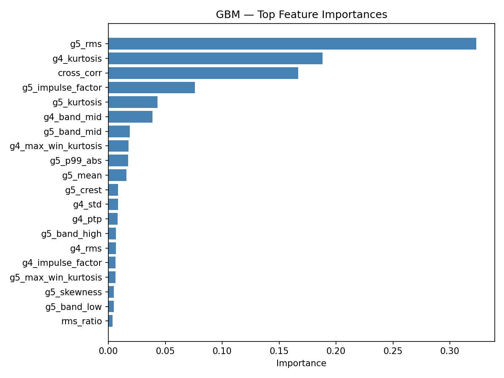

# Track Health Classifier

## Overview

Two supervised classifiers that predict track structural health — **Healthy**, **Degraded**, or **Damaged** — from the CRUISE-phase vibration signal of two accelerometers mounted on a moving train.

---

## Data & Labelling

### Source

Raw data lives in `data/TrainRuns/<material>/<condition>/<run_id>/`. The ETL pipeline (`ETL/build_labeled_dataset.py`) copies and labels every run into `classifier/processed/`, producing 270 labelled runs total.

### Label Rules

Labels are assigned purely by vibration magnitude and experiment setup — not by material type.

| Label | Rule |
|---|---|
| **Healthy** | Any non-unclipped run (no loose rail) |
| **Degraded** | Unclipped run with CRUISE RMS < 0.09 G, or a Healthy run augmented with small synthetic spikes (0.30 G, σ = 8 ms) |
| **Damaged** | Unclipped run with CRUISE RMS ≥ 0.09 G, or a Healthy run augmented with large synthetic spikes (0.65 G, σ = 15 ms) |

The 0.09 G threshold cleanly separates the three unclipped speed variants in the data: 1.5 fps (~0.055 G) and 3 fps (~0.085 G) fall below it as Degraded; 6 fps (~0.105 G) falls above it as Damaged.

### Synthetic Augmentation

Each of the 81 Healthy source runs was duplicated twice with Gaussian impulse spikes injected into the CRUISE section of `daq_sensors_1000hz.csv` — once at small amplitude (→ Degraded) and once at large amplitude (→ Damaged). This balances the class distribution and gives the classifiers explicit exposure to impulsive events.

**Final dataset (270 runs):**

| Label | Natural | Augmented | Total |
|---|---|---|---|
| Healthy | 81 | 0 | 81 |
| Degraded | 16 | 81 | 97 |
| Damaged | 11 | 81 | 92 |

---

## Train / Test Split

Split is performed with `GroupShuffleSplit` (80/20) grouped by `source_run_id`. This ensures that all augmented copies of a given source run land in the same partition as the original, preventing any form of label leakage through shared vibration signal.

| Set | Runs |
|---|---|
| Train | 218 |
| Test | 52 |

---

## Feature Engineering

33 features are extracted per run from the CRUISE phase of `daq_sensors_1000hz.csv`. The CRUISE window is derived from `arduino_motion_raw.csv` to exclude ACCEL and DECEL artefacts.

### Per-channel features (×2 for g4 and g5, 30 total)

| Feature | Description |
|---|---|
| `rms` | Root-mean-square acceleration |
| `mean` | DC offset |
| `std` | Standard deviation |
| `peak_to_peak` | Max − min |
| `kurtosis` | 4th-order moment normalised by σ⁴ — sensitive to heavy tails |
| `skewness` | 3rd-order moment normalised by σ³ |
| `crest_factor` | Peak / RMS |
| `band_low` | Fraction of FFT energy in 0–50 Hz |
| `band_mid` | Fraction of FFT energy in 50–200 Hz |
| `band_high` | Fraction of FFT energy in 200–500 Hz |
| `p99_abs` | 99th percentile of \|g\| — spike amplitude proxy |
| `exceedance_rate` | Fraction of samples > mean + 3σ — spike frequency proxy |
| `impulse_factor` | max(\|g\|) / mean(\|g\|) — impulsiveness relative to mean level |
| `max_win_rms` | Max RMS over sliding 50 ms windows — local energy burst |
| `max_win_kurtosis` | Max kurtosis over sliding 50 ms windows — surfaces brief spikes that dilute full-signal kurtosis |

The last five (`p99_abs` through `max_win_kurtosis`) were added specifically to address cases where a brief, isolated spike lands in an otherwise quiet signal — a scenario the aggregate statistics miss because the spike occupies only a handful of samples out of thousands.

### Cross-sensor features (3)

| Feature | Description |
|---|---|
| `cross_corr` | Pearson correlation between g4 and g5 — structural events appear on both sensors; noise does not |
| `rms_ratio` | g4 RMS / g5 RMS — asymmetric loading shifts this ratio |
| `diff_rms` | RMS of (g4 − g5) — differential vibration signal |

---

## Classifiers

### 1. K-Nearest Neighbours (KNN)

**Pipeline:** `StandardScaler → KNeighborsClassifier(k=7, metric="euclidean", weights="distance")`

Distance-weighted voting means closer neighbours have proportionally more influence. Scaling is essential since features span different orders of magnitude.

k = 7 was chosen as a starting point for a 3-class problem with ~200 training samples; distance weighting reduces sensitivity to the exact value of k.

**Results:**

| Metric | Value |
|---|---|
| CV balanced accuracy (5-fold) | 0.943 ± 0.035 |
| Test balanced accuracy | **0.964** |

```
              precision  recall  f1
Healthy           1.00    0.94  0.97
Degraded          1.00    0.95  0.97
Damaged           0.88    1.00  0.94
```

### 2. Gradient Boosting (GBM)

**Pipeline:** `StandardScaler → GradientBoostingClassifier(n_estimators=300, lr=0.05, max_depth=4, subsample=0.8)`

An ensemble of shallow decision trees trained sequentially on the residual error of the previous stage. Lower learning rate with more trees reduces overfitting. Subsampling (stochastic gradient boosting) adds regularisation and speeds training.

GBM was chosen as the second model because it operates differently from KNN — it learns axis-aligned decision boundaries via tree splits rather than neighbourhood distances — and natively produces feature importances for interpretability.

**Results:**

| Metric | Value |
|---|---|
| CV balanced accuracy (5-fold) | 0.932 ± 0.039 |
| Test balanced accuracy | **0.919** |

```
              precision  recall  f1
Healthy           0.89    0.94  0.92
Degraded          1.00    0.95  0.97
Damaged           0.87    0.87  0.87
```

---

## Feature Importances (GBM)

Top features by GBM split-gain importance:

| Rank | Feature | Importance |
|---|---|---|
| 1 | `g5_rms` | 0.323 |
| 2 | `g4_kurtosis` | 0.188 |
| 3 | `cross_corr` | 0.167 |
| 4 | `g5_impulse_factor` | 0.076 |
| 5 | `g5_kurtosis` | 0.043 |
| 6 | `g4_band_mid` | 0.039 |
| 7 | `g5_band_mid` | 0.019 |
| 8 | `g4_max_win_kurtosis` | 0.018 |
| 9 | `g5_p99_abs` | 0.017 |
| 10 | `g5_mean` | 0.016 |

`g5_rms` dominates, reflecting that overall vibration energy is the strongest discriminator between health states. `g4_kurtosis` and `cross_corr` rank second and third — kurtosis captures impulsive events and cross-correlation captures whether both sensors respond together (structural) versus independently (noise). Four of the top 10 features (`g5_impulse_factor`, `g4_max_win_kurtosis`, `g5_p99_abs`) are from the spike-detection feature set added in the second iteration, confirming they carry real discriminative signal.



---

## Outputs

All outputs are written to `classifier/output/`:

| File | Contents |
|---|---|
| `model_knn.joblib` | Serialised KNN pipeline (scaler + model) |
| `model_gbm.joblib` | Serialised GBM pipeline (scaler + model) |
| `confusion_knn.png` | KNN confusion matrix on test set |
| `confusion_gbm.png` | GBM confusion matrix on test set |
| `feature_importance_gbm.png` | Top-20 GBM feature importances |
| `results.json` | CV and test metrics, top-10 feature importances |

---

## Using the Module

```python
import classifier

# Load a trained model
model = classifier.load_model("knn")   # or "gbm"

# Predict on a new run
result = classifier.predict(
    model,
    daq_path="path/to/daq_sensors_1000hz.csv",
    motion_path="path/to/arduino_motion_raw.csv",
)

print(result["label"])          # "Healthy" | "Degraded" | "Damaged"
print(result["probabilities"])  # {"Damaged": 0.03, "Degraded": 0.06, "Healthy": 0.91}
```

Models must be trained first:

```bash
python classifier/train_classifiers.py
```
